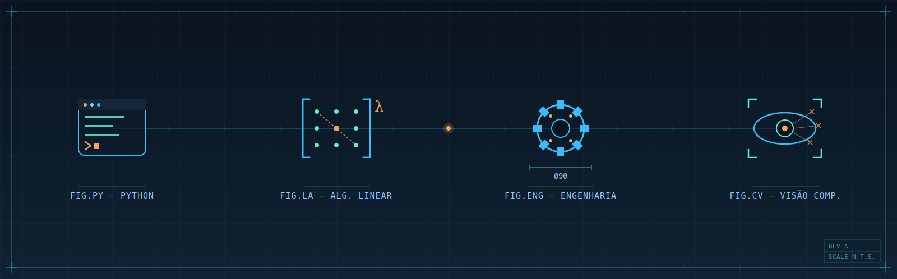

# Bem-vindo

## Sobre este material

Este livro foi desenvolvido com o objetivo de reunir conteúdos, estudos e aplicações práticas relacionados às disciplinas e projetos desenvolvidos ao longo da graduação, servindo como um ambiente de documentação, aprendizagem e compartilhamento de conhecimento.

Ao longo deste material, serão apresentados conceitos teóricos, exemplos práticos, implementações computacionais e estudos aplicados em diferentes áreas, buscando integrar a teoria com aplicações reais.

---

## Sobre o autor

**Gabriel Marcial de Paiva** é estudante de graduação na **Universidade Federal Fluminense (UFF)** e possui interesse nas áreas de Álgebra Linear Computacional, Ciência de Dados, Sensoriamento Remoto, Geoprocessamento e Visão Computacional.

Seus projetos acadêmicos envolvem a aplicação de métodos matemáticos e computacionais para análise e processamento de dados, utilizando ferramentas como Python e bibliotecas científicas para desenvolver soluções aplicadas a problemas reais.

Este material foi elaborado como uma forma de organizar conhecimentos, documentar experimentos e compartilhar resultados obtidos durante o desenvolvimento de trabalhos acadêmicos e projetos de pesquisa.

---

## Objetivos deste livro

- Apresentar conceitos teóricos de forma clara e objetiva;
- Desenvolver exemplos práticos utilizando Python;
- Demonstrar aplicações de Álgebra Linear Computacional;
- Explorar técnicas de processamento e análise de imagens;
- Documentar projetos e experimentos desenvolvidos ao longo da graduação.

---

## Organização do conteúdo

O conteúdo está dividido em capítulos independentes, permitindo uma navegação simples e progressiva. Cada seção aborda um tema específico, contendo explicações teóricas, exemplos práticos e códigos comentados.

Esperamos que este material seja útil como fonte de consulta, estudo e inspiração para novos projetos.

---

> **Observação:** Este livro está em constante atualização e novos conteúdos poderão ser adicionados ao longo do desenvolvimento acadêmico do autor.